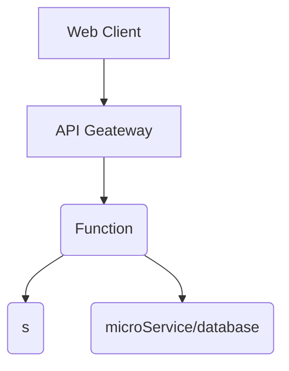

title: serverless浅谈介绍
speaker: vadxq
plugins:
    - echarts
    - mermaid

<slide class="bg-black-blue aligncenter" image="https://www.canva.cn/learn/wp-content/uploads/sites/17/2019/10/bridge-4456255_1280.jpg .dark">

# serverless浅谈介绍 {.text-landing.text-shadow}

By vadxq {.text-intro.animated.fadeInUp.delay-500}

[:fa-github: Github](https://github.com/vadxq/nodeppt-set){.button.ghost}

<slide class="bg-light aligncenter">

# 目录 {.text-landing}
----
-   背景现状
-   Serverless(无服务器)架构是什么
-   Serverless的两种形式
-   Serverless的优缺点
-   Serverless与前端
-   Serverless最佳实践（腾讯云的流程展示）

<slide class="bg-light aligncenter" >

# 背景现状 {.text-landing}
----
#### 自6月GMTC以来，国内腾讯和阿里云都铆足了劲在上面发力，提出了各自的解决方案，Serverless 越来越受重视 
#### 腾讯推出了 Serverless 2.0
#### 阿里云推出的预留模式

<slide class="bg-light aligncenter" >

# Serverless(无服务器)是什么
:::flexblock {.blink.border}

<!-- 最早由iron.io公司于2012年提出,目前尚无权威定义 {.text-intro} -->

无服务器架构是基于互联网的系统，其中应用开发不使用常规的服务进程。相反，它们仅依赖于第三方服务，客户端逻辑与托管远程服务之间的调用过程的组合。
==Wiki==
{.text-quote}

----

**特点：**
1. 1.服务端的主机和进程完全由供应商管理
2. 2.可以根据负载进行自动伸缩
3. 3.按照精确的使用情况来计费，就像水和电。（效用计算）
4. 4.供应商对 Serverless 服务的能力评估方式不再是单纯的提供多少CPU，多少硬盘空间这种的资源性指标了，而可能是可以承受多少峰值的并发数，实时性等类似的非功能性指标。
5. 5.由于服务端完全托管给给供应商，使用者无法介入，那么供应商应该提供很高的可用性保障
:::
<slide class="bg-light aligncenter">

# Serverless的两种形式 
----

#### MBaaS（Mobile Backend as a Service），简称 BaaS {.animated.bounceIn}

<!-- BaaS 有些类似 SaaS 的概念，只不过是更小粒度的应用。 -->
可以理解为 BaaS 就是有第三方提供的包含某一块功能的微服务，使用者以 API 形式接入。
<!-- 比较有名的有 Google Firebase。而国内的厂商 Lean Cloud 也提供了比较丰富的 BaaS 服务能力。 -->
<!-- BaaS 一开始更多的是服务于移动应用开发，为了让很多移动应用创业者可以更专注与应用端本身的业务，出现了 BaaS 这种服务形式，大大提高了他们的生产效率。 -->

#### FaaS（Function as a Service） {.animated.fadeInUp.delay-500}
FaaS 是一种面向函数的构建和部署软件的方式，最先由亚马逊提出，其标志性产品就是 AWS Lambda

<slide class="bg-light aligncenter">

<!-- <slide :class="size-40 aligncenter"> -->

# Serverless 应用组成

<!-- 1.网关 API Gateway 来接受和处理成千上万个并发 API 调用，包括流量管理、授权和访问控制、监控等
2.计算服务 Lambda 来进行代码相关的一切计算工作，诸如授权验证、请求、输出等等
3.基础设施管理 CloudFormation 来创建和配置 AWS 基础设施部署，诸如所使用的 S3 存储桶的名称等
4.静态存储 S3 作为前端代码和静态资源存放的地方
5.数据库 DynamoDB 来存储应用的数据 -->

<slide class="bg-light aligncenter">

`.text-cols (2 columns)`

:::div {.text-cols}

**Why WebSlides?** There are excellent presentation tools out there. WebSlides is about sharing content, essential features, and clean markup. **Each parent &lt;slide&gt;**  in the #webslides element is an individual slide.

**WebSlides help you build a culture of innovation and excellence**. When you're really passionate about your job, you can change the world. How to manage a design-driven organization? Leadership through usefulness, openness, empathy, and good taste.

:::

:::flexblock {.metrics}

:fa-phone:

Call us at 555.345.6789

----

:fa-twitter:

@username

----
:fa-envelope:
Send us an email
:::

<slide class="bg-light aligncenter">
<slide class="bg-light aligncenter">
<slide class="bg-light aligncenter">
<slide class="bg-light aligncenter">
<slide class="bg-light aligncenter">
<slide class="bg-light aligncenter">
<slide class="bg-light aligncenter">
<slide class="bg-light aligncenter">
<slide class="bg-light aligncenter">

这个概念最早由iron.io公司于2012年提出,目前尚无权威定义

- 腾讯推出了 Serverless 2.0
- 阿里云推出的预留模式
{.text-intro}
!

前端研发升级