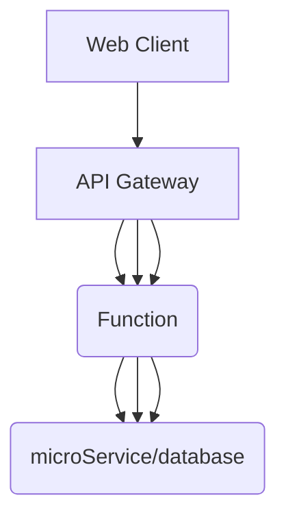
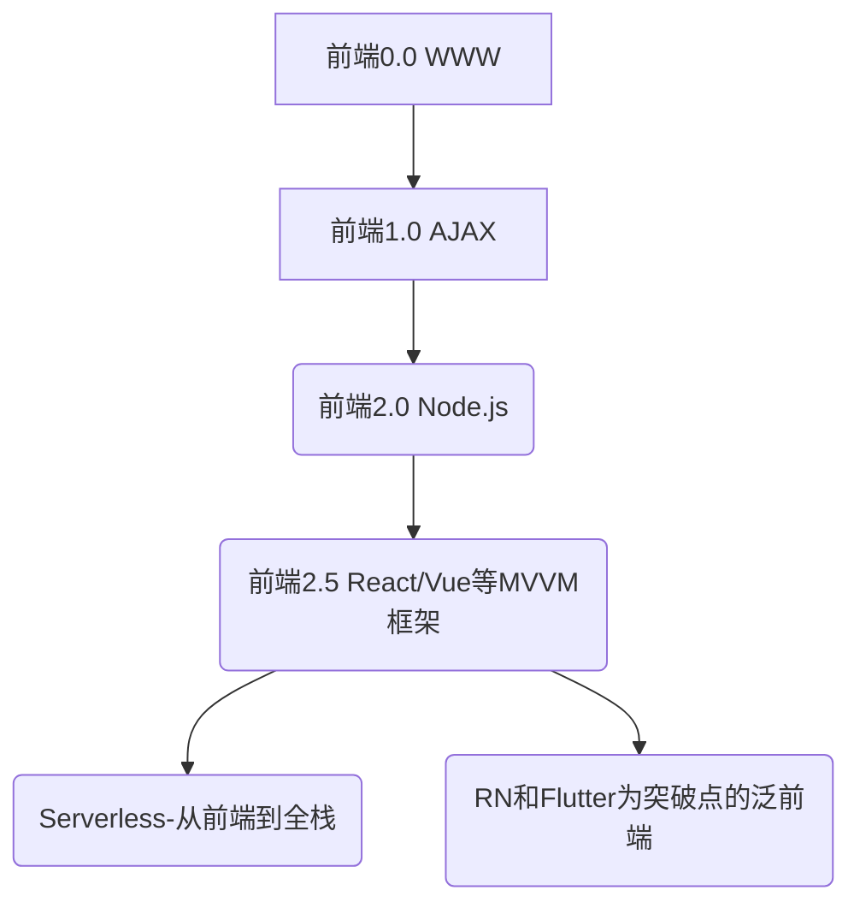

title: serverless浅谈介绍
speaker: vadxq
plugins:
    - echarts
    - mermaid

<slide class="bg-black-blue aligncenter" image="https://qnimg.vadxq.com/ppt/2019/bridge-4456255_1280.webp .dark">

# serverless浅谈介绍 {.text-landing.text-shadow}

By vadxq {.text-intro.animated.fadeInUp.delay-500}

[:fa-github: Github](https://github.com/vadxq/nodeppt-set){.button.ghost}

<slide class="bg-light aligncenter">

# 目录 {.text-landing}
----
-   背景现状
-   Serverless(无服务器)架构是什么
-   Serverless的两种形式
-   Serverless与前端
-   Serverless的优缺点
-   Serverless最佳实践（腾讯云的serverless程序流程展示）

<slide class="bg-light aligncenter" >

# 背景现状 {.text-landing}
----
#### 自6月GMTC以来，国内腾讯和阿里云都铆足了劲在上面发力，提出了各自的解决方案，Serverless 越来越受重视 
#### 腾讯推出了 Serverless 2.0
#### 阿里云推出的预留模式

<slide class="bg-light aligncenter" >

# Serverless(无服务器)是什么
:::flexblock {.blink.border}

<!-- 最早由iron.io公司于2012年提出,目前尚无权威定义 {.text-intro} -->

无服务器架构是基于互联网的系统，其中应用开发不使用常规的服务进程。相反，它们仅依赖于第三方服务，客户端逻辑与托管远程服务之间的调用过程的组合。
==Wiki==
{.text-quote}

----

**特点：**
1. 1.服务端的主机和进程完全由供应商管理
2. 2.可以根据负载进行自动伸缩
3. 3.按照精确的使用情况来计费，就像水和电。（效用计算）
4. 4.供应商对 Serverless 服务的能力评估方式不再是单纯的提供多少CPU，多少硬盘空间这种的资源性指标了，而可能是可以承受多少峰值的并发数，实时性等类似的非功能性指标。
5. 5.由于服务端完全托管给给供应商，使用者无法介入，那么供应商应该提供很高的可用性保障
:::
<slide class="bg-light aligncenter">

# Serverless的两种形式 {.text-landing}
----

#### MBaaS（Mobile Backend as a Service），简称 BaaS {.animated.bounceIn}

<!-- BaaS 有些类似 SaaS 的概念，只不过是更小粒度的应用。 -->
可以理解为 BaaS 就是有第三方提供的包含某一块功能的微服务，使用者以 API 形式接入。
<!-- 比较有名的有 Google Firebase。而国内的厂商 Lean Cloud 也提供了比较丰富的 BaaS 服务能力。 -->
<!-- BaaS 一开始更多的是服务于移动应用开发，为了让很多移动应用创业者可以更专注与应用端本身的业务，出现了 BaaS 这种服务形式，大大提高了他们的生产效率。 -->

#### FaaS（Function as a Service） {.animated.fadeInUp.delay-500}
FaaS 是一种面向函数的构建和部署软件的方式，最先由亚马逊提出，其标志性产品就是 AWS Lambda

<slide class="bg-light aligncenter">

<!-- <slide :class="size-40 aligncenter"> -->

# Serverless 应用组成 

<!-- 1.网关 API Gateway 来接受和处理成千上万个并发 API 调用，包括流量管理、授权和访问控制、监控等
2.计算服务 Lambda 来进行代码相关的一切计算工作，诸如授权验证、请求、输出等等
3.基础设施管理 CloudFormation 来创建和配置 AWS 基础设施部署，诸如所使用的 S3 存储桶的名称等
4.静态存储 S3 作为前端代码和静态资源存放的地方
5.数据库 DynamoDB 来存储应用的数据 -->

<slide class="bg-light aligncenter">

# Serverless与前端 {.text-landing}

<slide class="bg-light aligncenter">

### 前端变革 {.text-landing}

<slide class="bg-light aligncenter">

### 前端研发升级

:::flexblock {.metrics}

#### 前端赋能

打破现有的技术壁垒，朝着更底层，面向数据的地方去深入，探索
全面的视角来理解现有的体系

----

#### 前端提效

让 Serverless，用更轻量化的方式进行业务研发，降低整个前端参与业务交付的门槛，同时，在开发期间，也能减少人力总成本，让前端减负，业务小步快跑成为可能

:::

<slide class="bg-light aligncenter">

## Serverless的优缺点

<slide class="bg-light aligncenter">

:::flexblock {.metrics}

#### 减少资源开销

单进程下函数的性能非常不错，但是由于大促要提前预留一些资源，整体机器成本只降低到了平时的 70%，而在非大促期间，不需要预留这些资源，就能更低，降到 40% 以下

----

#### 降低运维成本

Serverless 最大的好处是减少运维，减少固定服务器资源，不需要用户关心调度等，同时也简化了开发的代码，专注了逻辑，晚上睡觉会更加的放心，不再担心机器容量不足而报警。

----

#### 减少治理成本

对于应用治理来说，之前会考虑各种版本碎片化的问题，node 的多版本，框架的多版本，以及启动脚本、依赖等等问题，而用 Serverless
之后，将这些都固化了，用户也不关心这些，一切都变的简单了，我们也只需要治理运行时一个版本即可。

----

#### 降低研发成本

在业务前端方面，带来的是挑战和机遇，一方面，前端的工作量增大了，能干的事情也变多了，成了一职多能的多面手，也更了解业务了，另一方面，传统的后端可以从和前端沟通中解放出来，更专注于提供服务。前端从传统的面向接口编程变成了面向服务编程，大大简化了调用链路

:::

<slide class="bg-light aligncenter">

#### 减轻流程负担

在流程方面，原来需要在各个环境准备和调研，从一开始申请应用，申请预算，申请环境开始，需要了解各个方面的知识，和不同部门的人打交道，流程审批也很长，而现在只需要在我们的统一研发平台上直接申请函数组，替代了原本的复杂流程，也提升了整个开发体验。

同时在编码中也不再考虑路由，MVC 的事情，这些在网关层配置就好，编写代码时会更关注逻辑，和之前的构建发布不同的是，现在增加了云端集成测试的步骤，由于函数和前端代码一样，是分版本的，也不担心修改到线上的正常服务，在测试完毕后，只需要将旧函数的 tag 指向新函数即可，这就完成了整个切流的过程，而一旦碰到问题，把 tag 切回去就行。

<slide class="bg-light aligncenter">

!

<slide class="bg-light aligncenter">

!

<slide class="bg-light aligncenter">

### Serverless 不足之处

---

#### 老应用的迁移成本巨大
#### 需要k8s和knative等技术改造出serverless平台
#### 目前无论是理论解读还是实践模式都尚未形成绝对统一

<slide class="bg-light aligncenter">

## 老应用的迁移

---

1、使用 FaaS + Baas 的方式进行重构，代码更精简，就是需要改造成本 {.animated.bounceIn}

2、把整个传统应用作为一个函数，虽然不够优雅，但是能解决迁移的问题 {.animated.bounceIn}

<slide class="bg-light aligncenter">

### 传统代码的结构分解

---

- HTTP 服务，原框架（koa/midway/egg…)，Node.js 运行时，启动脚本等，将会变为函数运行时，固化下来

- 原有的 HTTP Router，Web 中间件等，将会由 HTTP 网关承接

- 原有的 Controller，业务逻辑（调用远程服务），继续保留，变为函数代码

- 原有的数据库，消息队列，RPC 调用等，都作为 BaaS 服务，用户只关心对应的服务，使用同一的 BaaS Client 进行调用

<slide class="bg-light aligncenter">

#### 需要k8s和knative等技术改造出serverless平台？

上云

---

#### 目前无论是理论解读还是实践模式都尚未形成绝对统一？

这个只能去摸索探讨了，但可以预见前端开发者将成为Serverless的最大受益群体之一

<slide class="bg-light aligncenter">

# Serverless最佳实践（腾讯云的流程展示）

<slide class="bg-black aligncenter" image="https://qnimg.vadxq.com/ppt/2019/photo-1421930535025-d2af27c14065.jfif ">
:::{.aligncenter}

# 谢谢！

Thank you !
:::

:::footer

[回味：https\://ppt.vadxq.com](https://ppt.vadxq.com){.alignleft}

[:fa-github: @vadxq](https://github.com/vadxq){.alignright}
[:fa-twitter: @vadxq](https://github.com/vadxq){.alignright}

:::

<!-- :::header
Header (logo) :.alignright:{.alignright} -->
:::